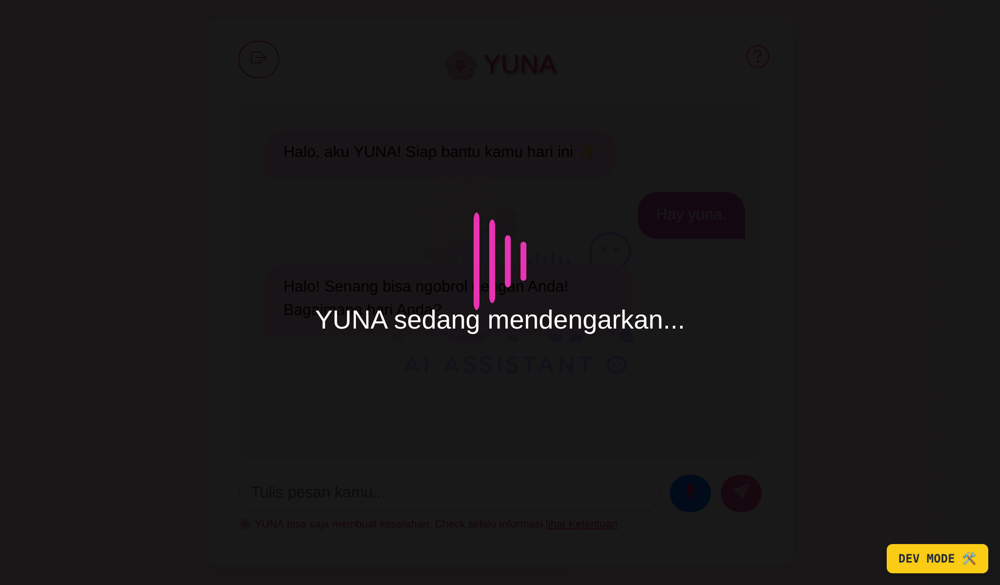

# YUNA - AI Asisten Suara Berbasis Jekyll + JavaScript

[DEMO AI-chat](https://putridinar.github.io/yuna-AI/)

## 🖼️ Screenshot

|             YUNA-AI            |
|--------------------------------|
||

YUNA adalah proyek AI asisten pribadi berbasis web yang dibangun menggunakan **Jekyll**, **JavaScript vanilla**, dan **Cloudflare Workers** sebagai backend AI. YUNA memiliki tampilan feminin, fitur suara, serta sistem login berbasis Firebase Authentication.

## 🔮 Fitur Utama

* 🎙️ Input suara (SpeechRecognition)
* 🗣️ Output suara (SpeechSynthesis)
* 📣 Ketik per huruf + bersuara
* 👩 Suara wanita (ID, female voice)
* ☁️ API Chat via Cloudflare Workers (Groq/Gemini/LLM)
* 🔐 Login Google via Firebase
* 🔓 Anonymous dengan batas 3x chat
* 📦 Penyimpanan data via Firestore (opsional)
* 🌐 Share Chat, FAQ, Terms, dll
* 🚫 Rate limit harian dengan KV (Cloudflare)

## 🛠️ Stack Teknologi

* Frontend: Jekyll + Bootstrap 5 + Vanilla JS
* Backend: Cloudflare Workers (API Chat)
* Database: Firebase Firestore
* Auth: Firebase Auth
* Deployment: GitHub Pages + GitHub Actions

## 🚀 Deploy via GitHub Actions

GitHub Actions digunakan untuk inject konfigurasi Firebase production langsung ke dalam project saat `push` ke `master`:

```yaml
- name: Inject Firebase config
  run: |
    mkdir -p ./_site/assets/js
    echo "window.FIREBASE_CONFIG = {" > ./_site/assets/js/firebase-config.js
    echo "  apiKey: '${{ secrets.FIREBASE_API_KEY }}'," >> ./_site/assets/js/firebase-config.js
    ... (dan seterusnya)
```

## 🔐 Firebase Config

### Production

Diinject otomatis via GitHub Actions ke `firebase-config.js`

### Development (local)

Buat file lokal:

```js
// /assets/js/firebase-config.local.js
window.FIREBASE_CONFIG = {
  apiKey: "your-local-key",
  authDomain: "localhost",
  ...
};
```

## 💬 Struktur Chat

```html
<div class="chat-bubble user">Halo Yuna</div>
<div class="chat-bubble yuna">Halo juga, ada yang bisa Yuna bantu?</div>
```

Animasi mengetik + suara dijalankan beriringan.

## 📛 Rate Limiting (Anonim)

Disimpan di KV dengan format key: `anon-<ip>`

```js
const key = `anon-${ip}`;
await env.YUNA_USAGE_KV.put(key, JSON.stringify({ count, reset }), { expirationTtl: 86400 });
```

Jika melebihi limit:

|           YUNA-login           |
|--------------------------------|
||

```json
{
  "reply": "Maaf, kamu sudah mencapai batas chat gratis. Yuk login untuk akses lebih lanjut!",
  "limitReached": true,
  "remaining": 0
}
```

## 📂 Struktur File (Umum)

```
.
├── public/
├── assets/
│   └── js/
│       ├── firebase-config.js (production)
│       ├── firebase-config.local.js (local dev)
│       ├── script.js (logic utama Yuna)
├── index.html
├── faq.html
├── terms.html
└── ...
```

## 🤖 AI Model

YUNA menggunakan Groq API dengan model:

* `llama3-8b-8192` (default)
* Bisa diatur dari query param `?model=...`

Contoh:

```js
fetch("https://yuna-api.workers.dev/?model=llama3-8b-8192", {...})
```

## 📜 Lisensi

MIT License

---

> Dibuat dengan ❤️ oleh Putri dan YUNA, thanks to Daffa ❤️

